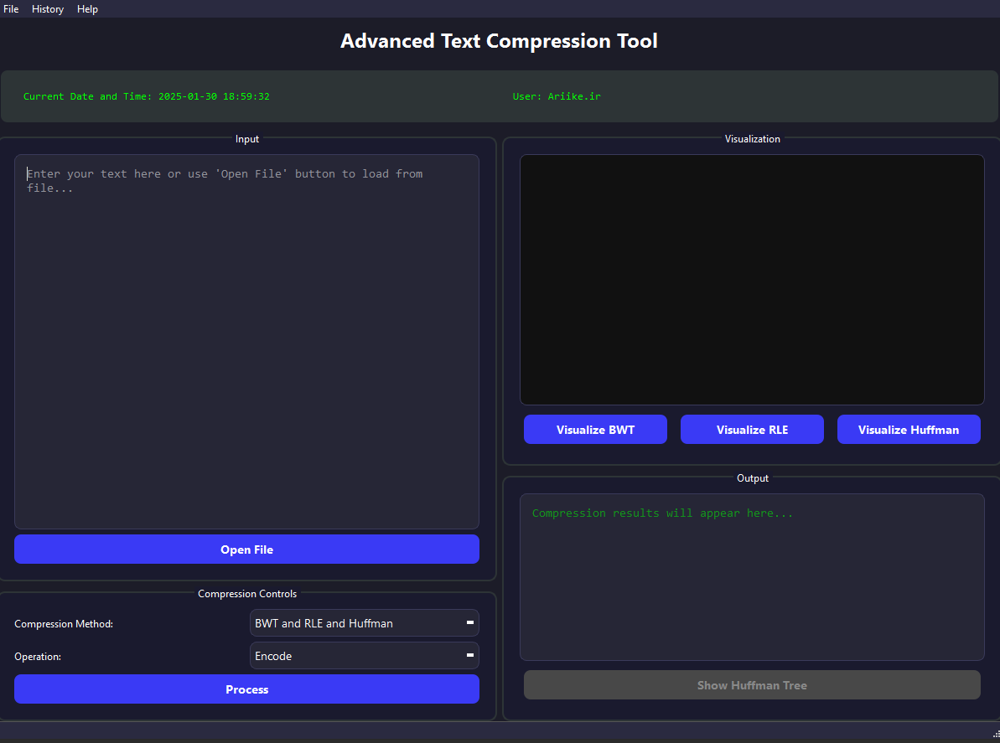

# Advanced Text Compression Tool 🔄

[](https://www.python.org/downloads/)
[](https://pypi.org/project/PyQt6/)
[](https://github.com/shayan-shm/BWT-RLE-Huffman-Compressor)

A powerful and user-friendly text compression tool implementing multiple compression algorithms with a modern GUI interface. This project was developed as part of the Data Structures and Algorithms course.



## 🌟 Features

- **Multiple Compression Algorithms:**
  - Burrows-Wheeler Transform (BWT)
  - Run-Length Encoding (RLE)
  - Huffman Coding
  - Combined compression (BWT + RLE + Huffman)
  - Enhanced visualization for each algorithm
  - Step-by-step process display
  - Improved compression ratios

- **Interactive GUI:**
  - Modern and intuitive interface
  - Real-time compression visualization
  - Interactive Huffman tree visualization
  - Dark theme for better readability
  - Direct step navigation in visualization
  - Smooth animations and transitions
  - Improved text display with fixed font size

- **Advanced Functionality:**
  - File import/export support
  - Compression history tracking
  - Performance metrics
  - Interactive text selection and copying
  - NEW: Enhanced error handling
  - NEW: Progress indicators
  - NEW: Auto-proceed option

## 🛠️ Installation

1. Clone the repository:
```bash
git clone https://github.com/shayan-shm/BWT-RLE-Huffman-Compressor.git
cd BWT-RLE-Huffman-Compressor
```

2. Run the application:
```bash
python gui_test.py
```

## 📋 Requirements

- Python 3.8 or higher
- PyQt6
- NEW: QSS styling support
- NEW: Unicode text handling

## 🎯 Usage

1. **Launch the Application:**
   - Run `gui_test.py` to start the GUI interface

2. **Input Text:**
   - Type directly into the input field
   - Or use "Open File" to load text from a file

3. **Choose Compression Method:**
   - Select one of the available algorithms:
     - BWT (Burrows-Wheeler Transform)
     - RLE (Run-Length Encoding)
     - Huffman Coding
     - Combined (BWT + RLE + Huffman)

4. **Select Operation:**
   - Encode: Compress the text
   - Decode: Decompress the text
   - Encode → Decode: Test both operations

5. **View Results:**
   - Compressed/decompressed text in output area
   - Compression statistics
   - Visualization of the process

## 🔍 Algorithm Details

### Burrows-Wheeler Transform (BWT)
- Rearranges text to make it more compressible
- Particularly effective for text with repeated sequences
- Reversible transformation

### Run-Length Encoding (RLE)
- Simple compression for repeated characters
- Encodes repeated characters as character count pairs
- Effective for text with many repeated sequences

### Huffman Coding
- Variable-length prefix coding
- Builds frequency-based binary tree
- Optimal for character-level compression
- Interactive tree visualization available


## 📊 Features in Detail

### Compression Visualization
- Real-time process visualization
- Step-by-step algorithm execution
- Interactive Huffman tree display with zoom and pan
- Copy and selection support in visualization panel
- NEW: Direct step navigation
- NEW: Fixed font size for better readability
- NEW: Automatic text wrapping
- NEW: Smooth scrolling

### Text Handling
- Unicode support
- Large file handling
- Copy/paste functionality
- Text selection support

### History Tracking
- Compression statistics logging
- Performance metrics
- Historical comparisons
- Export capabilities

## 🎨 UI Features

- **Main Window:**
  - Split view design
  - Dark theme
  - Status indicators
  - Progress feedback
  - Enhanced control panel
  - Improved text display

- **Visualization Panel:**
  - Interactive graphics
  - Zoom controls
  - Pan functionality
  - Reset view option
  - Direct step navigation
  - Fixed font size display
  - Smooth scrolling

- **Control Panel:**
  - Algorithm selection
  - Operation modes
  - File operations
  - History access
  - Step navigation controls
  - Animation speed control
  - Auto-proceed option

## 🔧 Technical Details

### Project Structure
```
BWT-RLE-Huffman-Compressor/
├── gui_test.py
├── advanced_compression_tool.py
├── styles.qss
├── main_window.ui
└── README.md
```

### Key Components
- `gui_test.py`: Application entry point and GUI implementation
- `advanced_compression_tool.py`: Core compression algorithms
- `styles.qss`: UI styling and themes
- `main_window.ui`: Qt Designer UI layout

## 🤝 Contributing

Contributions are welcome! Please feel free to submit a Pull Request. For major changes, please open an issue first to discuss what you would like to change.

1. Fork the repository
2. Create your feature branch (`git checkout -b feature/AmazingFeature`)
3. Commit your changes (`git commit -m 'Add some AmazingFeature'`)
4. Push to the branch (`git push origin feature/AmazingFeature`)
5. Open a Pull Request

## 👥 Authors

- **Shayan** - *Initial work* - [shayan-shm](https://github.com/shayan-shm)
- **Pezhman** - *Initial work* - [Pezhm4n](https://github.com/Pezhm4n)

## 🙏 Acknowledgments

- PyQt6 team for the excellent GUI framework
- Data Structures and Algorithms course instructors
- All contributors who have helped with testing and improvements

## 📞 Contact

For questions and support, please create an issue in the GitHub repository or contact the maintainers:

#### Email:
- shayan.shm2003@gmail.com 
- pksarmadi@gmail.com

---

<p align="center">
  Made with ❤️ by Shayan & Pezhman
</p>